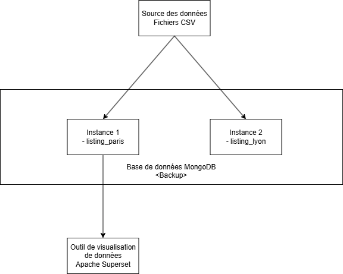
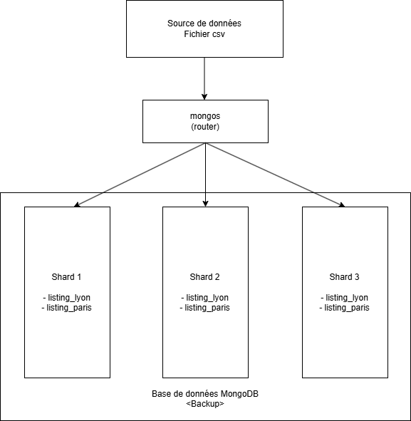

# Projet 7 - Conception d'une architecture NoSQL pour Airbnb

## Contexte et objectifs

Ce projet a pour but de surveiller les plateformes de location de courte durée pour mesurer l’impact sur les villes, ici Paris et Lyon. Malheureusement, lors de la première semaine, il y a eu un crash de la base de données.

Grâce à une sauvegarde, nous avons pu réintégrer cette base de données afin d’en tirer les analyses voulues initialement.
Ce projet s’est donc déroulé en 3 étapes :

- La restauration des données 
- L’analyse de l’intégrité des données
- La pérennisation de la base

---

## Technologies utilisées

- **MongoDB** : base de données NoSQL orientée documents, utilisée pour stocker les annonces Airbnb. Trois modes d'architecture ont été explorés : instance standalone, replica set (haute disponibilité) et cluster shardet (scalabilité horizontale).
- **Docker / Docker Compose** : orchestration des différents services MongoDB et Python dans des environnements conteneurisés isolés, reproductibles et facilement configurables.
- **Python** : utilisé pour l'import des données CSV dans MongoDB (via la librairie `pymongo` et `pandas`) et pour l'analyse des données (via la librairie `Polars`).
- **Polars** : librairie Python de traitement de données hautes performances, utilisée pour effectuer des analyses sur les données extraites de MongoDB.
- **MongoDB Compass / mongosh** : outils de visualisation et d'interrogation de la base de données MongoDB utilisés pendant le développement et la validation.

---

## Installation et utilisation

### Prérequis

- Docker et Docker Compose installés sur la machine
- Python installé (avec pip)
- Les fichiers CSV (Paris et Lyon) placés dans le dossier `csv/` (non présents sur Github pour des raisons de volumétrie)

### Etapes

**1. Cloner le dépôt**

```bash
git clone https://github.com/Arcthis/Projet_7.git
cd Projet_7
```

**2. Choisir une architecture et démarrer les conteneurs**

Trois configurations Docker Compose sont disponibles :

| Fichier | Architecture |
|---|---|
| `docker-compose.yml` | Instance MongoDB simple (standalone) |
| `docker-compose-replica.yml` | Replica set avec 3 noeuds + conteneur Python |
| `docker-compose-final.yml` | Cluster shardet avec serveurs de configuration et routeur mongos |

```bash
# Exemple avec le replica set
docker compose -f docker-compose-replica.yml up -d
```

**3. Importer les données CSV**

Une fois les conteneurs démarrés, lancer le script d'import depuis le conteneur Python :

```bash
docker exec -it python_importer python /scripts/import_script.py
```

Ce script lit le fichier CSV des annonces parisiennes et l'insère dans la collection `listing_paris` de la base `backup`.

**4. Lancer les requêtes analytiques**

Les requêtes MongoDB d'agrégation sont disponibles dans le fichier `nosql_request.txt` et peuvent être exécutées dans MongoDB Compass ou via mongosh.

Pour les analyses Python avec Polars :

```bash
docker exec -it python_importer python /scripts/polar_request.py
```

---

## Résultats obtenus

### Architecture

Trois architectures MongoDB ont été mises en place et comparées :

- **Instance standalone** : configuration minimale, suffisante pour les tests et le développement, mais sans tolérance aux pannes.
- **Replica set** : trois noeuds MongoDB synchronisés (un primaire, deux secondaires). Cette configuration garantit la haute disponibilité et la continuité de service en cas de panne d'un noeud.
- **Cluster shardet** : architecture distribuée composée d'un shard de trois noeuds, trois serveurs de configuration et un routeur `mongos`. Elle permet de répartir les données sur plusieurs machines pour absorber de grands volumes.

Les diagrammes d'architecture sont disponibles dans le dossier `Screenshots/`.





### Analyse des données

Les requêtes réalisées sur les données parisiennes ont permis d'extraire plusieurs indicateurs :

- La répartition des annonces par type de logement (chambre privée, logement entier, chambre partagée, etc.)
- Les 5 annonces ayant reçu le plus grand nombre d'évaluations
- Le nombre total d'hôtes distincts et la proportion de super-hôtes
- La proportion d'annonces réservables instantanément
- L'identification des hôtes gérant plus de 100 annonces et leur part dans l'ensemble des hôtes

En complément, les analyses effectuées avec Polars ont permis de calculer :

- Le taux de réservation moyen par type de logement
- La médiane du nombre d'avis par logement et par catégorie d'hôte
- La densité de logements par quartier
- Les quartiers parisiens avec le plus fort taux de réservation mensuel

Les captures d'écran des résultats sont disponibles dans le dossier `Screenshots/`.